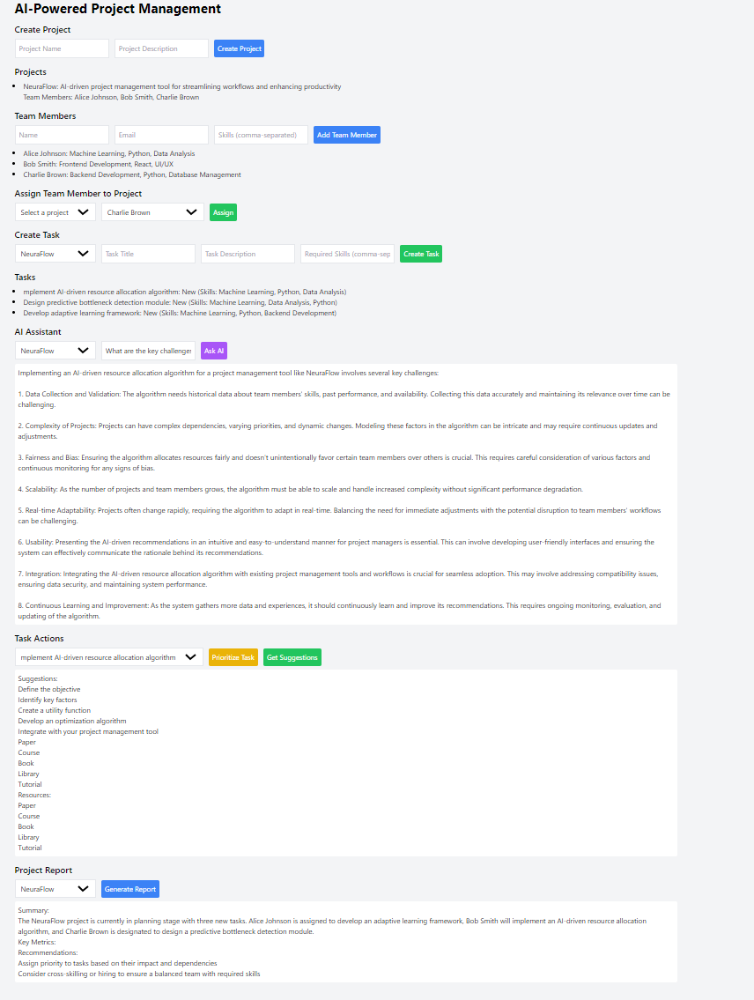
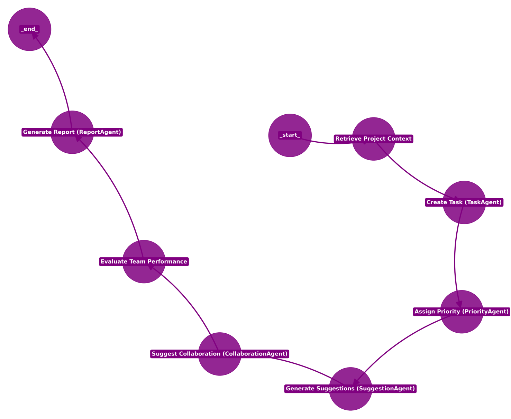

# **AI-Powered Project Management System with RAG**

This project is an **AI-Powered Project Management System** utilizing **Retrieval-Augmented Generation (RAG)** to streamline the management of complex projects. By combining AI-driven techniques with structured workflows, the system offers enhanced efficiency in task execution, team collaboration, and decision-making processes.

## **Project Management UI Screen**



## **Project Flow Diagram**



## **Key Features**

- **Task Management with AI Assistance**: The `TaskAgent` generates tasks based on project descriptions and historical data. The `PriorityAgent` analyzes and prioritizes tasks using a data-driven approach.
- **Retrieval-Augmented Generation (RAG)**: The system implements RAG, which integrates FAISS for similarity search and language models via `langchain_ollama` and `langchain_groq` to deliver context-aware task suggestions, reports, and recommendations.
- **Team Collaboration and Formation**: The `CollaborationAgent` analyzes team capabilities and project requirements to suggest optimal team configurations and communication strategies.
- **Comprehensive Project Reporting**: The `ReportAgent` generates detailed reports on project progress, including key metrics, risks, and insights, helping project managers make informed decisions.
- **Workflow Orchestration with LangGraph**: The system orchestrates project workflows using a **graph-based approach**, where tasks are represented as nodes in a **stateful graph**. Each node corresponds to a specific step in the project lifecycle—such as task creation, priority assignment, and report generation. This allows for highly adaptable workflows that can dynamically adjust based on project context and changes. LangGraph ensures that the transitions between these steps are logical, structured, and responsive to project updates in real time.

## **Tech Stack**

- **AI & NLP Frameworks**: `LangChain` for embeddings and retrieval tasks, `Langchain_ollama` for embeddings, `Langchain_groq` for AI-based suggestions, and `LangGraph` for managing stateful workflows.
- **Backend Framework**: FastAPI, integrated with SQLAlchemy for database interactions.
- **Vector Store**: FAISS for storing and retrieving embeddings based on similarity search.
- **Authentication**: OAuth2 with JWT for secure access.
- **Database**: SQLAlchemy for persistent data storage.
- **Frontend UI**: HTML, Javascript, Tailwind css.

## **Getting Started**

### **Prerequisites**

- Python 3.12
- SQLAlchemy database instance
- Groq API Key for enhanced AI capabilities
- FAISS installation

### **Installation**

**Clone the Repository:**

```bash
git clone https://github.com/mohdwarish483/Multi_AI_Agent_Project_Management_System.git
cd Multi_AI_Agent_Project_Management_System
```

**Install the Dependencies:**

```bash
pip install -r re_new.txt
```

**Launch the Backend Application:**

```bash
uvicorn main:app --reload
```

**Launch Frontend by Looking instructions in **server_run_info.txt**

## **Example Output**

Sample project creation and team assignment:

```bash
Project: NeuraFlow
Team Members: Alice Johnson (Machine Learning), Bob Smith (Frontend Development), Charlie Brown (Backend Development)
Tasks:
1. Implement AI-driven resource allocation algorithm
2. Design predictive bottleneck detection module
```

The AI will will generate this kind of suggestions for the given task:

```bash
Task: Implement AI-driven resource allocation algorithm
Suggestions:
- Define the objective
- Identify key factors
- Develop an optimization algorithm
```
